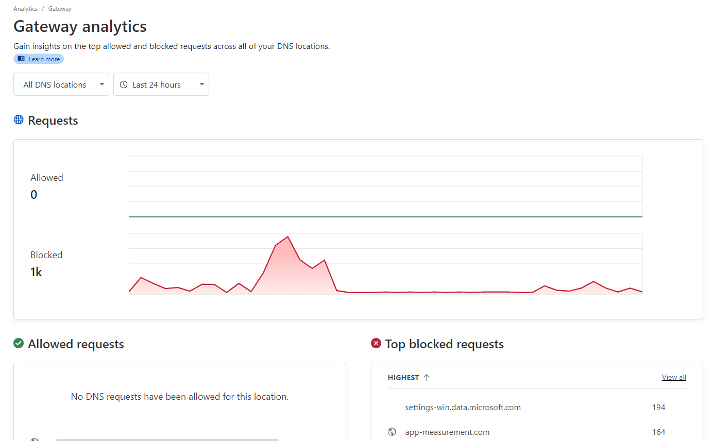

# Cloudflare Gateway Ad Blocker (CGAB)

Cloudflare Gateway allows you to create custom rules to filter HTTP, DNS, and network traffic based on your firewall policies. This is a collection of scripts that can be used to get a similar experience as if you were using Pi-hole, but with Cloudflare Gateway - so no servers to maintain or need to buy a Raspberry Pi!

## About the individual scripts

- `cf_list_delete.js` - Deletes all lists created by CGPS from Cloudflare Gateway. This is useful for subsequent runs.
- `cf_list_create.js` - Takes a blocklist.txt file containing domains and creates lists in Cloudflare Gateway
- `cf_gateway_rule_create.js` - Creates a Cloudflare Gateway rule to block all traffic if it matches the lists created by CGPS.
- `cf_gateway_rule_delete.js` - Deletes the Cloudflare Gateway rule created by CGPS. Useful for subsequent runs.
- `download_lists.js` - Initiates blocklist and whitelist download.

## Features

- Support for basic hosts files
- Full support for domain lists
- Automatically cleans up filter lists: removes duplicates, invalid domains, comments and more
- Works fully unattended
- Whitelist support, allowing you to prevent false positives and breakage by forcing trusted domains to always be unblocked.
- Optional health check: Sends a ping request ensuring continuous monitoring and alerting for the workflow execution.

## License

MIT License. See `LICENSE` for more information.